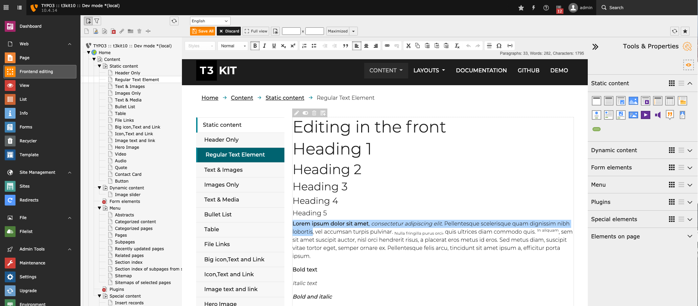

.. include:: ../Includes.txt

.. _introduction:

Introduction
============

.. _about-this-document:

About this extension
--------------------

This package adds frontend editing capability to TYPO3 CMS, using `CKEditor <http://ckeditor.com/>`, the rich text editor used by the TYPO3 core. The editor appears as a new backend module. When selecting a page in the page tree, the page becomes editable. Editable regions are configured in the templates, using Fluid or TypoScript.

   Frontend Editing in the TYPO3 Backend.

.. _credits:

Credits
-------

Initial parts of this manual was based on :ref:`Inside TYPO3 <t3inside:start>`. It was adjusted and
updated to fit with the frontend_editing modules as found in current versions.

The :ref:`placeholder feature <extension-manager-settings-features>` makes use of the `confighelper <https://github.com/AlfonsoML/confighelper>`__ CKEditor plugin by AlfonsoML. The plugin is released under `Mozilla Public License 2.0 <https://www.mozilla.org/en-US/MPL/2.0/>`__.

.. _feedback:

Feedback
--------

If you find a bug either in this manual or in the frontend editing /
extension please use the `bug tracker <https://github.com/FriendsOfTYPO3/frontend_editing/issues>`__.

.. _contribution:

Contribution
------------

`Pull requests <https://github.com/FriendsOfTYPO3/frontend_editing/pulls>`__ are very welcome indeed. Please feel free to contribute features, bug fixes, and improvements.

`Donate to the project through PayPal <https://www.paypal.com/cgi-bin/webscr?cmd=_s-xclick&hosted_button_id=WPXRSUTAJNRES&source=url>`__

