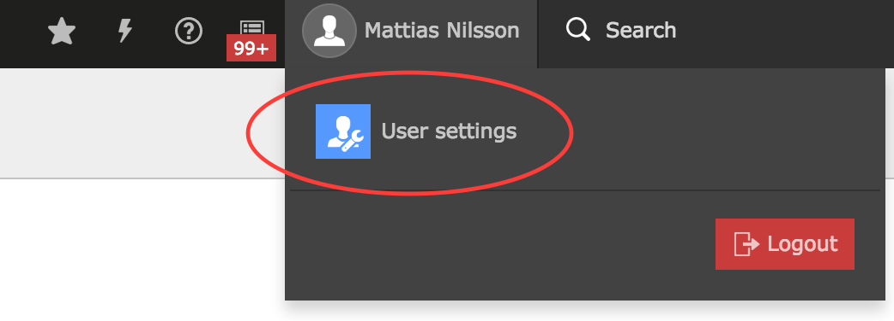

.. include:: ../Includes.txt

.. _user-settings:

User Settings
-------------

There is a few possibilities to customize the appearance and functionality of
how the frontend editing works.

.. _right-toolbar:

Right Toolbar
"""""""""""""

If the user have a smaller screen the default push effect behaviour of the
right toolbar can really make the screen size small. There is a possibility
to chose which behaviour should be used.

*Push*

Is the default which just pushes all the content to the left when used.

*Overlay*

This is added as an overlay and behaves in the same way as the left toolbar
with the page tree.

The settings can be changes in the Users personal settings:

.. figure:: ../Images/ActivateRightbarOverlay.png
   :alt: Activate the right toolbar as overlay