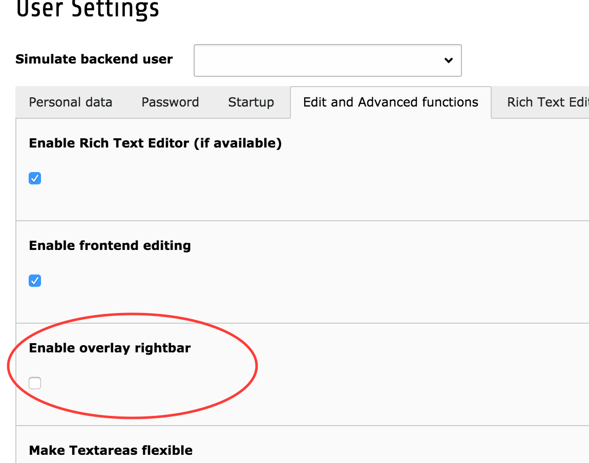

# Activate the right toolbar as overlay or push

If the user have a smaller screen the default push effect behaviour of the
right toolbar can really make the screen size small. There is a possibility
to chose which behaviour should be used.

## Push

Is the default which just pushes all the content to the left when used.

## Overlay

This is added as an overlay and behaves in the same way as the left toolbar
with the page tree.

The settings can be changes in the Users personal settings:

 